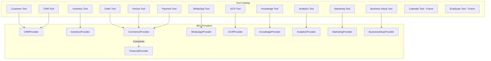

# AI Kernel & Business Knowledge Layer (BKL) Architecture

This document defines the consolidated architecture for the AI Kernel and the Business Knowledge Layer (BKL) in the Vyapaar AI Suite backend. It maps the toolsets, active files, and provider behaviors for the hackathon build.

---

## 1. Directory Structure

All kernel engine components and business adapters are organized as follows under `artifacts/api-server/src/`:

```
artifacts/api-server/src/
├── kernel/                      # AI Kernel Core Execution Engine
│   ├── ARCHITECTURE.md          # [THIS FILE] System Architecture & Source of Truth
│   ├── EventEngine.ts           # Listens to and dispatches system-wide events
│   ├── PlannerEngine.ts         # Decomposes goals into sequential execution steps
│   ├── ContextEngine.ts         # Assembles live context matrix from databases
│   ├── ToolEngine.ts            # Dispatches actions to BKL Providers
│   └── MemoryEngine.ts          # Manages command session state and chat history
│
├── providers/                   # BKL Integration Providers (Consolidated Tool Adapters)
│   ├── BaseProvider.ts          # Abstract class defining Provider agreements
│   ├── CommerceProvider.ts      # Combines Order, Invoice, and Payment operations
│   ├── FinancialProvider.ts     # Analyzes ledger states, P&L, and GST reports
│   ├── CRMProvider.ts           # Integrates Customer and CRM/Lead lifecycle pipelines
│   ├── InventoryProvider.ts     # Manages stock volumes and vendor ordering
│   ├── WhatsAppProvider.ts      # Handles message routing, history, and auto-replies
│   ├── KnowledgeProvider.ts     # Wraps RAG-grounded support catalog queries
│   ├── AnalyticsProvider.ts     # Manages forecasting models and diagnostic insights
│   ├── MarketingProvider.ts     # Drives automated promotional message generation
│   └── OCRProvider.ts           # Handles receipt/bill extraction via vision AI
│
└── controllers/
    └── kernelController.ts      # HTTP Command Center entry point for command streams
```

---

## 2. Consolidated Provider Mapping

To reduce codebase bloat and simplify table queries, we map the requested 13-tool ecosystem into **10 Consolidated BKL Providers**.



---

## 3. Provider Specifications

### 1. CommerceProvider
*   **Reconciles:** Order Tool, Invoice Tool, Payment Tool.
*   **Existing Code Location:** [`artifacts/api-server/src/routes/commerce.ts`](file:///d:/Vyapaar-AI-Guide/artifacts/api-server/src/routes/commerce.ts) (specifically `/orders`, `/invoices`, and `/payments` route handlers).
*   **Exposed Actions:**
    *   `create_order(orgId, customerId, items, paymentMethod)`: Generates checkout orders and inserts order line items.
    *   `update_order_status(orderId, status)`: Transitions transaction order statuses.
    *   `generate_invoice(orderId)`: Records new billing invoices based on active orders.
    *   `record_payment(invoiceId, amount, paymentMethod)`: Logs payments and marks invoice status.
*   **Scope Boundaries (What it does NOT do):** Does not check stock levels (delegated to `InventoryProvider`) or update customer info directly (delegated to `CRMProvider`).

### 2. FinancialProvider
*   **Reconciles:** Financial analysis (P&L ledger, GST compilation).
*   **Existing Code Location:** [`artifacts/api-server/src/routes/commerce.ts`](file:///d:/Vyapaar-AI-Guide/artifacts/api-server/src/routes/commerce.ts) & [`artifacts/api-server/src/routes/analytics.ts`](file:///d:/Vyapaar-AI-Guide/artifacts/api-server/src/routes/analytics.ts).
*   **Exposed Actions:**
    *   `calculate_pl_balance(orgId, startDate, endDate)`: Reads invoices and payments to compute operational balance margins.
    *   `generate_gst_report(orgId, quarter)`: Processes invoice values and compiles tax obligations.
*   **Scope Boundaries (What it does NOT do):** Does not write transactions or modify payment records. It composes with `CommerceProvider` to read and summarize transaction ledger data.

### 3. CRMProvider
*   **Reconciles:** Customer Tool, CRM Tool.
*   **Existing Code Location:** [`artifacts/api-server/src/routes/crm.ts`](file:///d:/Vyapaar-AI-Guide/artifacts/api-server/src/routes/crm.ts) (handles customers, leads, inquiries, and tasks).
*   **Exposed Actions:**
    *   `create_customer(orgId, name, email, phone)`: Registers customer contact profiles.
    *   `create_lead(orgId, customerId, source, notes)`: Spawns sales lead pipeline tracking points.
    *   `update_lead_status(leadId, status)`: Modifies lead pipelines.
    *   `create_task(orgId, title, description, assignedTo)`: Creates staff assignments.
    *   `create_service_ticket(orgId, customerId, title, description, priority, assignedTo)`: Registers service or support tickets.
    *   `search_customers(orgId, query)`: Searches customer contact profiles by name, email, or phone.
*   **Scope Boundaries (What it does NOT do):** Does not record product catalogs or manage transaction billing codes.

### 4. InventoryProvider
*   **Reconciles:** Inventory Tool.
*   **Existing Code Location:** [`artifacts/api-server/src/routes/commerce.ts`](file:///d:/Vyapaar-AI-Guide/artifacts/api-server/src/routes/commerce.ts) (specifically `/products` and catalog/stock management handlers).
*   **Exposed Actions:**
    *   `adjust_stock_level(productId, quantity)`: Updates catalog inventory balances.
    *   `create_purchase_order(orgId, supplierId, items)`: Registers supply-chain requests.
    *   `sync_catalog_prices(orgId, pricingUpdate)`: Bulk-updates product retail catalog values.
*   **Scope Boundaries (What it does NOT do):** Does not process consumer checkout payments or schedule logistics routing.

### 5. WhatsAppProvider
*   **Reconciles:** WhatsApp Tool.
*   **Existing Code Location:** [`artifacts/api-server/src/routes/webhooks.ts`](file:///d:/Vyapaar-AI-Guide/artifacts/api-server/src/routes/webhooks.ts) (specifically the webhook logs and settings endpoints).
*   **Exposed Actions:**
    *   `send_broadcast(orgId, numbers, messageText)`: Sends bulk outbound campaign announcements.
    *   `send_inquiry_reply(inquiryId, replyText)`: Routes conversational responses back to customers.
    *   `update_chatbot_rules(branchId, autoReply)`: Toggles automated responder rules.
*   **Scope Boundaries (What it does NOT do):** Does not perform OCR scans or run complex vector index lookups.

### 6. KnowledgeProvider
*   **Reconciles:** Knowledge Tool (RAG support bot).
*   **Existing Code Location:** [`artifacts/api-server/src/routes/knowledge.ts`](file:///d:/Vyapaar-AI-Guide/artifacts/api-server/src/routes/knowledge.ts).
*   **Exposed Actions:**
    *   `upload_document(orgId, filename, buffer)`: Indexes merchant documents and populates text vector chunks.
    *   `query_knowledge(orgId, question)`: Performs vector similarity search and answers queries.
*   **Scope Boundaries (What it does NOT do):** Does not update inventory tables or assign staff routes.

### 7. AnalyticsProvider
*   **Reconciles:** Analytics Tool.
*   **Existing Code Location:** [`artifacts/api-server/src/routes/analytics.ts`](file:///d:/Vyapaar-AI-Guide/artifacts/api-server/src/routes/analytics.ts).
*   **Exposed Actions:**
    *   `get_dashboard_analytics(orgId)`: Fetches active charts, KPI sales histories, and aggregate values.
    *   `generate_inventory_forecast(orgId, days)`: Evaluates inventory velocities and returns stockout date estimations.
    *   `generate_revenue_forecast(orgId)`: Calculates projected monthly billing trends.
*   **Scope Boundaries (What it does NOT do):** Does not run marketing campaign broadcasts or handle physical item shipments.

### 8. MarketingProvider
*   **Reconciles:** Marketing Tool.
*   **Existing Code Location:** [`artifacts/api-server/src/routes/ai.ts`](file:///d:/Vyapaar-AI-Guide/artifacts/api-server/src/routes/ai.ts) (specifically `/copilot/marketing` generation handles).
*   **Exposed Actions:**
    *   `generate_campaign_copy(businessName, businessType, topic)`: Automatically structures captions or email broadcast templates.
    *   `send_marketing_campaign(orgId, campaignId)`: Deploys generated assets.
*   **Scope Boundaries (What it does NOT do):** Does not directly record invoices or alter pricing structures.

### 9. BusinessSetupProvider
*   **Reconciles:** Business Setup Tool.
*   **Existing Code Location:** [`artifacts/api-server/src/routes/ai.ts`](file:///d:/Vyapaar-AI-Guide/artifacts/api-server/src/routes/ai.ts) (specifically `/copilot/onboarding` and `/copilot/branding` routes).
*   **Exposed Actions:**
    *   `analyze_onboarding(businessName, businessType, serviceType)`: Recommends required core modules and tracks maturity indices.
    *   `generate_branding_profile(businessName, businessType, preferredColor)`: Configures custom color matrices and tagline bios.
*   **Scope Boundaries (What it does NOT do):** Does not index user knowledge documents or modify operational order parameters.

### 10. OCRProvider
*   **Reconciles:** OCR Tool.
*   **Existing Code Location:** [`artifacts/api-server/src/routes/ai.ts`](file:///d:/Vyapaar-AI-Guide/artifacts/api-server/src/routes/ai.ts) (specifically `/copilot/ocr-invoice`).
*   **Exposed Actions:**
    *   `extract_invoice_items(fileBuffer, mimeType)`: Evaluates bill layout structures and translates them to structured line items.
*   **Scope Boundaries (What it does NOT do):** Does not save items or customers to the DB repository; only extracts structured parameters.

---

## 4. Future Tool Roadmap

These modules are designated as **planned for future release** and will not be scaffolded or coded for the hackathon MVP:

1.  **Calendar Tool (`CalendarProvider`)**
    *   *Intended Scope:* Schedule customer appointments and track technician shift rosters.
    *   *MVP Status:* Postponed; current calendar UI routes are served via static mocks.
2.  **Employee Tool (`EmployeeProvider`)**
    *   *Intended Scope:* Track staff check-ins, record delivery agent routes, and audit performance targets.
    *   *MVP Status:* Postponed; user roles default to primary mock owners.
